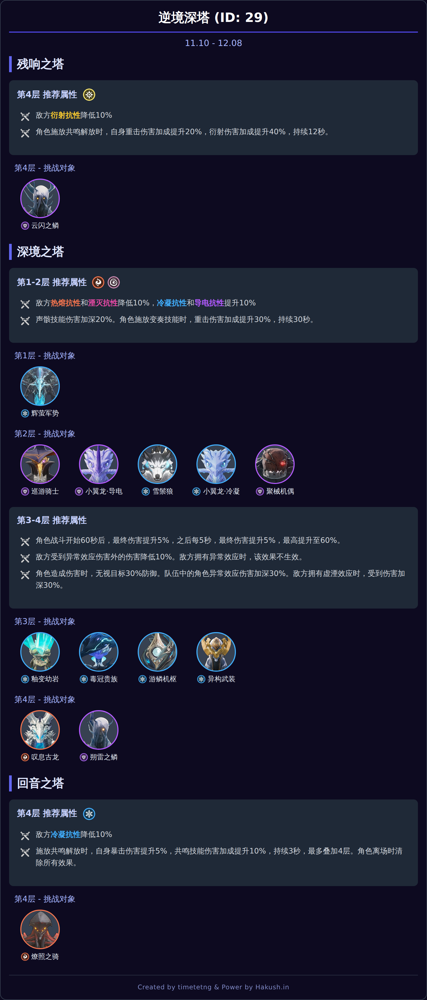

# Astrbot鸣潮深塔信息查询插件

## 基本功能

这是一个基于AstrBot框架的插件，用于查询游戏《鸣潮》中的逆境深塔信息，并将结果以图片形式发出。

数据来源于 [Hakush.in](https://hakush.in/)，感谢其提供的数据支持。

## ✨ 功能特性

* **数据可视化**: 将模仿Hakush原版web风格渲染成一张清晰直观的图片。
* **智能的周期计算**: 自动处理深塔期数计算，确保您总能查询到正确的深塔信息。
* **灵活的查询方式**: 支持通过关键词（如“上期”、“下期”）或具体的期数 ID 进行查询。
* **高效的缓存机制**: 查询过的深塔图片会被缓存，再次查询时可实现秒级响应。
* **自动更新索引**: 插件会在后台自动更新深塔数据索引，无需手动干预。

## 📸 效果预览

## 🚀 命令列表

| 命令 | 别名 | 功能描述 |
| :--- | :--- | :--- |
| `/深塔` | `/深渊` | 查询当期逆境深塔信息。 |
| `/深塔 [期数]` | `/深渊 [期数]` | 查询指定期数的深塔，例如：`/深塔 26`。 |
| `/深塔 [关键词]` | `/深渊 [关键词]` | 使用关键词查询，支持：`当期`, `本期`, `上期`, `下期`, `下下期`。 |
| `/当期深塔` | `/本期深塔` | 快捷查询当前周期的深塔信息。 |
| `/上期深塔` | | 快捷查询上一周期的深塔信息。 |
| `/下期深塔` | | 快捷查询下一周期的深塔信息。 |
| `/下下期深塔`| | 快捷查询下下周期的深塔信息。 |
| `/清除深塔缓存` | | 手动清除所有已生成的深塔图片缓存。 |
| `/深塔帮助` | | 显示此插件的帮助信息。 |

## 🛠️ 安装与依赖

1.  将插件文件夹 `astrbot_plugin_tower` 放置于 AstrBot 的 `plugins` 目录下。
2.  插件依赖以下库：
    * `httpx`
    * `playwright`
    * `jinja2`
3.  首次加载 `playwright` 时，可能需要下载相应的浏览器内核。请根据终端提示完成安装。

## 📄 开源许可

本项目使用 [GNU General Public License v3.0](https://www.gnu.org/licenses/gpl-3.0) 开源许可。
