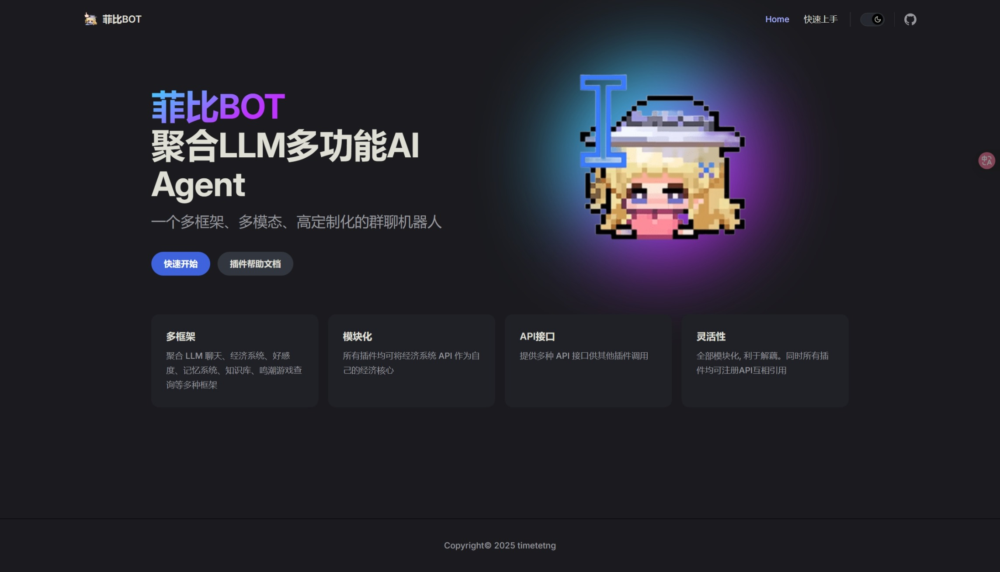
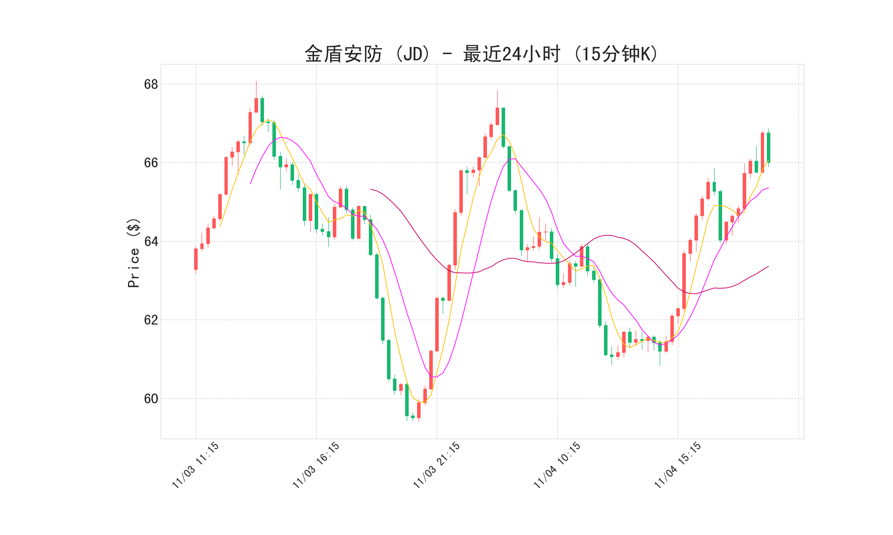
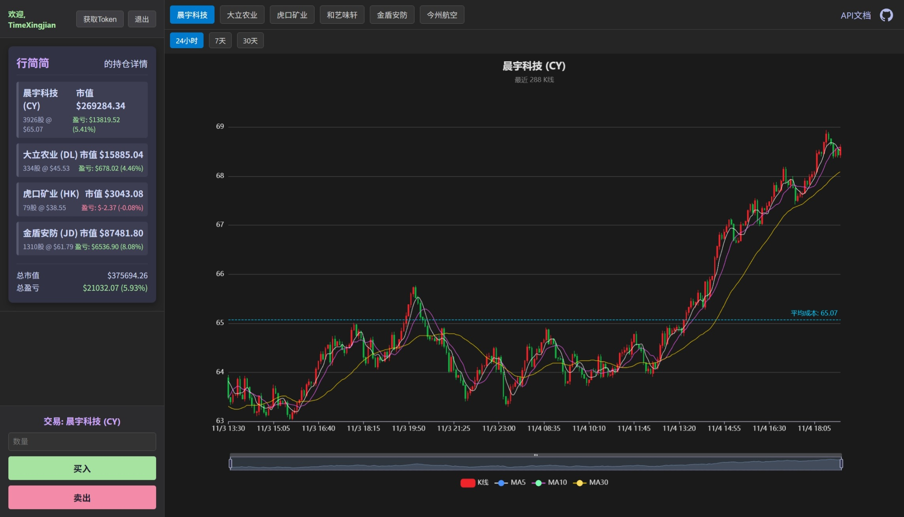
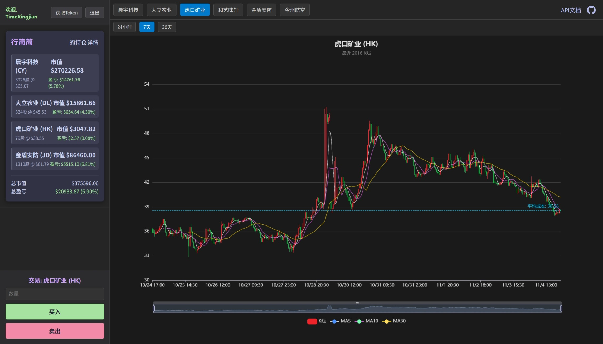

<h1 align="center">
Astrbot 虚拟股票市场插件

</h1>

`astrbot_stock_market` 是一个为 AstrBot 设计的高度模块化的模拟股票交易插件。它构建了一个动态的、持续变化的虚拟股票市场，允许用户进行注册、交易，并通过丰富的指令和现代化的 Web 界面与之交互。该插件不仅模拟了股价的随机波动，还引入了宏观经济周期、市场情绪和随机事件，为用户提供了一个沉浸式的虚拟投资体验。

此外，项目还提供了一套完整的 RESTful API，方便其他开发者或插件进行二次开发和数据集成。
<h2 align="center">
<a href="#-showcase">📸 Showcase</a> 
</h2>
<table align="center">
<tr>
        <td></td>
                <td></td>
  </tr>
  <tr>
    <td></td>
       <td></td>
       </tr>
</table>

<h4 align="center">
  <a href="https://docs.leewater.online/%E5%BC%80%E5%8F%91%E6%96%87%E6%A1%A3/API%E6%96%87%E6%A1%A3/%E5%88%9B%E5%BB%BAAPI%E5%85%B1%E4%BA%AB%E7%9B%AE%E5%BD%95.html">✨ 如何使用</a> | <a href="https://docs.leewater.online/">📄 帮助文档</a> | 依赖 <a href="https://github.com/timetetng/astrbot_plugin_sign">经济系统</a> | <a href="https://stock.leewater.online/">📈 WebUI 示例</a> |  <a href="https://docs.leewater.online/%E5%BC%80%E5%8F%91%E6%96%87%E6%A1%A3/%E8%99%9A%E6%8B%9F%E8%82%A1%E7%A5%A8API%E6%8E%A5%E5%8F%A3%E6%96%87%E6%A1%A3.html">🤖 API 文档</a> 
</h4>

---

## ✨ 主要功能

  * **动态市场模拟**:

      * 股票价格会根据预设的波动率和复杂的算法进行实时更新。
      * 内置宏观经济模型，可模拟牛市、熊市和盘整市等不同市场周期。
      * 市场情绪会随机在“高波动期”与“低波动期”之间切换，影响股价变化范围。
      * 系统会随机触发原生市场事件（如行业利好/利空、企业丑闻等），直接影响股价。

  * **全面的交易系统**:

      * 支持基本的买入 (`/买入`) 和卖出 (`/卖出`) 操作。
      * 提供便捷的“梭哈” (`/梭哈股票`)、“全抛” (`/全抛`) 和“清仓” (`/清仓`) 等快捷指令。
      * 交易系统包含手续费和滑点机制，模拟真实交易成本。
      * 引入 T+N 锁仓机制，买入的股票需要一段时间后才能卖出，增加了策略性。

  * **数据持久化与管理**:

      * 所有用户数据、持仓记录、K线历史和股票信息均使用 `SQLite` 进行持久化存储。
      * 通过异步数据库库 `aiosqlite` 保证高并发下的性能和数据一致性。

  * **现代化 Web 界面与 API**:

      * 内置一个基于 `aiohttp` 的异步 Web 服务器，提供数据可视化和 API 服务。
      * 用户可以通过专属链接访问 Web 界面，查看所有股票的实时 K 线图（由 `ECharts` 驱动）和个人持仓详情。
      * 提供了一套完整的 RESTful API，用于查询行情、获取用户资产和执行交易。
      * API 接口采用 JWT (JSON Web Token) 进行安全认证，并设有速率限制以防止滥用。

  * **丰富的指令交互**:

      * 支持通过 QQ 机器人使用指令进行所有核心操作，如查看行情、交易、查询资产等。
      * 可将复杂的持仓详情和股东列表渲染成图片发送，提升移动端的可读性（由 `Playwright` 驱动）。
      * 管理员拥有专属指令，可以动态地添加/删除股票、修改股票参数，甚至强行设定市场趋势。

## 📂 项目结构

```
.
├── API 接口文档.md       # API 详细说明文档
├── database.py           # 数据库管理模块，负责所有数据库操作
├── main.py               # 插件主入口，负责指令注册、插件生命周期管理
├── models.py             # 定义项目中使用的数据模型 (Enums, Dataclasses)
├── simulation.py         # 市场模拟核心逻辑，负责股价更新和事件生成
├── trading.py            # 交易逻辑处理模块，封装买入、卖出等原子操作
├── web_server.py         # aiohttp Web 服务器，提供 Web UI 和 RESTful API
├── api.py                # 供其他插件调用的标准化 API 接口
├── utils.py              # 工具函数模块，如 JWT 生成、密码哈希等
├── static/               # 存放 CSS, JavaScript, Favicon 等静态文件
│   ├── script.js
│   └── style.css
└── templates/            # 存放 Jinja2 HTML 模板文件
    ├── charts_page.html
    └── portfolio_card.html
```

## 🚀 如何开始

### 环境依赖

  * Python 3.10+
  * AstrBot 框架
  * 主要 Python 库:
      * `aiosqlite`
      * `aiohttp`
      * `playwright`
      * `jinja2`
      * `passlib[bcrypt]`
      * `PyJWT`
      * `echarts` (前端)

### 安装

1.  将整个 `astrbot_stock_market` 文件夹放入 AstrBot 的 `plugins` 目录下。
2.  安装 `Playwright` 的浏览器依赖：
    ```bash
    playwright install
    ```
3.  启动 AstrBot，插件将自动加载。

4.  此项目依赖本人开发的其他插件`astrbot_plugin_sign`、`astrbot_plugin_industy`、`astrbot_bank_plugin`，否则将因缺少**经济系统  API**无法正常使用，由于大多数插件仍属于开发状态，因此暂时不提供仓库。体验可前往QQ群**625684997**体验和反馈。

## 🎮 使用指南

### 主要用户指令

  * **/股票列表**: 查看当前市场所有可交易的股票及其最新价格。
  * **/行情 `<股票代码/名称>`**: 查询指定股票的详细实时行情。
  * **/K线 `<股票代码/名称>`**: 生成并发送指定股票的 K 线图图片。
  * **/webk [`股票代码/名称`]**: 获取一个专属的 Web 页面链接，用于查看实时 K 线图和个人持仓。
  * **/持仓图**: 以图片形式查看您当前的持仓详情和盈亏状况。
  * **/资产**: 查询您包括现金、股票、公司、银行存款在内的总资产和服务器排名。
  * **/买入 `<股票代码/名称> <数量>`**: 购买指定数量的股票。
  * **/卖出 `<股票代码/名称> <数量>`**: 卖出指定数量的已解锁股票。

### Web 界面

1.  通过对机器人发送 `/webk` 指令获取您的专属链接。
2.  在浏览器中打开链接，即可看到所有股票的K线图。
3.  点击页面上的“注册/登录”按钮，按照提示完成账号与 QQ 的绑定。
4.  登录后，您将可以在页面上直接查看您的持仓详情和交易成本线。
